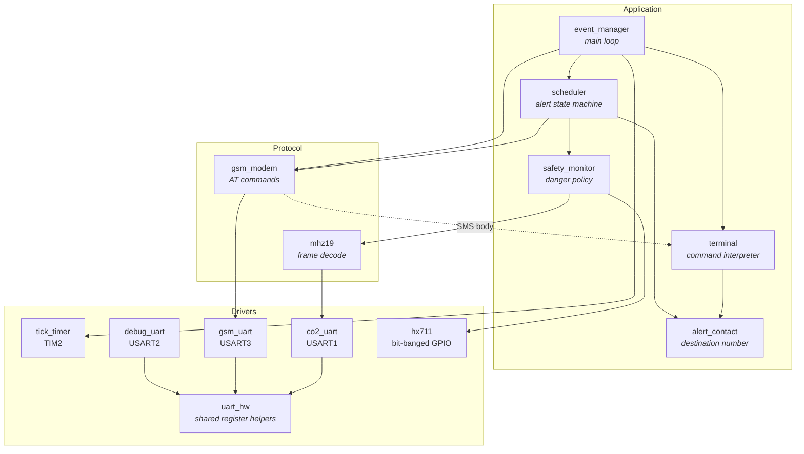

# CareCar — Embedded Child Safety System

Bare-metal STM32 firmware that detects when a child has been left alone in a
vehicle and calls a configured phone number over GSM.

Every year children die of heatstroke in parked cars. CareCar is a
self-contained ECU that watches the cabin continuously and escalates to a phone
call when it is confident a child is at risk — with no cloud service, no app,
and no dependency on the driver remembering anything.

---

## Contents

- [Features](#features)
- [How it decides](#how-it-decides)
- [Architecture](#architecture)
- [Hardware](#hardware)
- [Technology](#technology)
- [Project structure](#project-structure)
- [Getting started](#getting-started)
- [Usage](#usage)
- [Configuration](#configuration)
- [Implementation notes](#implementation-notes)
- [Engineering decisions](#engineering-decisions)
- [Known limitations & future work](#known-limitations--future-work)

---

## Features

- **Continuous cabin monitoring** — seat occupancy from two load cells, cabin
  CO₂ and temperature from an NDIR sensor, sampled once per second.
- **Debounced alert policy** — the danger condition must hold for several
  consecutive samples before an alert is raised, so sensor noise cannot place a
  phone call.
- **GSM voice alert** — dials the emergency contact directly from the ECU and
  hangs up automatically after a fixed ring time.
- **Remote configuration by SMS** — the contact number can be changed by texting
  the device; no reflash, no cable.
- **Local debug console** — the same command interpreter is reachable over a
  serial terminal, and every state transition is logged.
- **No RTOS, no HAL** — a cooperative event loop over direct register access,
  with all application logic at thread level.

---

## How it decides

The safety policy is deliberately small and readable, because it is the part of
the system that decides whether to raise an alarm:

```
danger = child_present AND (driver_absent OR cabin_unsafe)
```

| Term | Source | Default threshold |
|---|---|---|
| `child_present` | Child seat load cell (HX711) | raw counts ≥ 5 |
| `driver_absent` | Driver seat load cell (HX711) | no weight detected |
| `cabin_unsafe` | MH-Z19 CO₂ / temperature | > 600 ppm or > 30 °C |

`danger` must hold for **3 consecutive ticks** (3 s) before the alert fires.
A failed sensor read reports "unsafe = false" rather than an undefined value, so
a broken sensor can never *cause* an alarm.

Alert lifecycle:

```mermaid
stateDiagram-v2
    [*] --> Monitoring
    Monitoring --> Alerting : danger confirmed for 3 ticks
    Alerting --> Calling : ATD<number>; sent
    Calling --> Monitoring : 20 s elapsed, AT+CHUP sent
```



---

## Architecture

The firmware is a **cooperative event loop**. Interrupt handlers do nothing but
capture bytes and raise flags; the main loop turns those flags into work. As a
result no application code ever runs in interrupt context, which removes the
need for locking, critical sections or reentrancy analysis anywhere above the
driver layer.



**Layering rule:** dependencies point downward only. Drivers know nothing about
the application; `gsm_uart` reaches the command interpreter through a callback
registered by `gsm_modem`, never by calling upward.

Three responsibilities are kept strictly apart:

| Module | Owns | Deliberately does *not* |
|---|---|---|
| `safety_monitor` | Reading sensors, deciding whether a child is at risk | Know that alerts are phone calls |
| `scheduler` | When to alert, how long to ring, when to hang up | Know how "danger" is computed |
| `gsm_modem` | AT command syntax, SMS unsolicited result codes | Know what an alert means |

Splitting these means the alert policy can be re-tuned, or the GSM modem
swapped for LoRa or Wi-Fi, without touching the other two.

---

## Hardware

| Component | Interface | Pins |
|---|---|---|
| **STM32F303RE** (Nucleo-64) | Cortex-M4F @ 8 MHz HSI, 512 KB flash, 64 KB SRAM | — |
| **SIMCom GSM modem** | USART3 @ 115200 | PB10 (TX), PB11 (RX) |
| **MH-Z19 CO₂ + temperature** | USART1 @ 9600 | PA9 (TX), PA10 (RX) |
| **HX711** — child seat load cell | Bit-banged GPIO | PB0 (SCK), PB1 (DOUT) |
| **HX711** — driver seat load cell | Bit-banged GPIO | PB2 (SCK), PB3 (DOUT) |
| **Debug console** (ST-LINK VCP) | USART2 @ 9600 | PA2 (TX), PA3 (RX) |

---

## Technology

- **C11**, freestanding, no dynamic allocation after startup
- **CMSIS-Core** register definitions only — no ST HAL, no CubeMX-generated code
- **GNU Arm Embedded** toolchain (`arm-none-eabi-gcc` 12.3)
- **STM32CubeIDE** project files, plus a standalone `Makefile` for CI/terminal builds

---

## Project structure

```
CareCar/
├── Inc/
│   ├── app_config.h        All tuning constants: thresholds, baud, pins, timings
│   ├── alert_contact.h     Destination phone number
│   ├── safety_monitor.h    Danger policy
│   ├── scheduler.h         Alert state machine
│   ├── event_manager.h     Main loop
│   ├── terminal.h          Shared command interpreter
│   ├── gsm_modem.h         AT command layer
│   ├── gsm_uart.h          USART3 transport
│   ├── co2_uart.h          USART1 transport
│   ├── debug_uart.h        USART2 console
│   ├── mhz19.h             CO₂ frame protocol
│   ├── hx711.h             Load cell amplifier driver
│   ├── tick_timer.h        TIM2 system tick
│   ├── uart_hw.h           Register helpers shared by the UART drivers
│   └── cmsis_*.h, core_cm4.h, stm32f303xe.h, ...   (vendored CMSIS)
├── Src/                    One .c per header above
├── Startup/
│   └── startup_stm32f303retx.s   Vector table and reset handler
├── STM32F303RETX_FLASH.ld  Linker script
├── Makefile                Command line / CI build
└── .cproject, .project     STM32CubeIDE project definition
```

Application headers and vendored CMSIS headers share `Inc/` because that is the
include path STM32CubeIDE's managed build expects; separating them would mean
diverging from the IDE's project model for cosmetic gain.

---

## Getting started

### Prerequisites

- [GNU Arm Embedded toolchain](https://developer.arm.com/downloads/-/arm-gnu-toolchain-downloads) (`arm-none-eabi-gcc`), **or** [STM32CubeIDE](https://www.st.com/en/development-tools/stm32cubeide.html)
- [`stlink`](https://github.com/stlink-org/stlink) tools for flashing from the command line
- A serial terminal (PuTTY, `screen`, `minicom`) at **9600 8N1**

### Build

**With the Makefile:**

```bash
git clone https://github.com/michaelkarvat/CareCar.git
cd CareCar
make                    # -> build/carecar.elf, .bin, .hex
make flash              # writes build/carecar.bin to 0x08000000
```

**With STM32CubeIDE:**

`File → Import → Existing Projects into Workspace`, select the repository root,
then `Project → Build All` and `Run → Debug`.

### Run

1. Flash the board.
2. Connect a serial terminal to the ST-LINK virtual COM port at 9600 baud.
3. Set the emergency contact (see below) — until you do, alerts are logged but
   no call is placed.

---

## Usage

The device accepts the same one-line commands over **either** the debug console
**or** SMS.

Set the number to call:

```
setnum +972500000000
```

`setnum 972500000000` is equivalent — the leading `+` is added automatically.

Typical console session:

```
CareCar starting
GSM modem link up
Sensors up
Init complete
Event loop running
> setnum +972500000000
Alert number set to +972500000000
weight child=20 driver=20 | CO2=412 ppm temp=24 C
weight child=20 driver=20 | CO2=780 ppm temp=31 C
Danger condition held for 1/3 ticks
Danger condition held for 2/3 ticks
Danger condition held for 3/3 ticks
** Alert condition confirmed **
*** ALERT: child left in vehicle ***
Calling +972500000000
modem => OK
Calling: 19 ticks remaining
...
Hanging up
```

---

## Configuration

Every threshold, pin, baud rate and timing lives in
[`Inc/app_config.h`](Inc/app_config.h). Nothing else needs to be edited to
re-tune the system:

```c
#define CABIN_TEMPERATURE_LIMIT_C       30
#define CABIN_CO2_LIMIT_PPM             600
#define ALERT_DEBOUNCE_TICKS            3U
#define ALERT_CALL_DURATION_TICKS       20U
```

**The emergency contact number is not stored in source control.**
`DEFAULT_ALERT_PHONE_NUMBER` is intentionally empty — a phone number is
deployment data, not source code. Set it at runtime with `setnum`. Until it is
set, the firmware logs the alert and explains that no number is configured
rather than dialling anything.

### Simulation mode

The load cells are not fitted on the current prototype, so the default build
substitutes fixed weights:

```c
#define USE_SIMULATED_SEAT_WEIGHTS      1
```

This exercises the complete sample → decide → alert path from the CO₂ and
temperature sensors alone. Set it to `0` once the load cells are wired. This is
a compile-time switch rather than commented-out code so that both paths stay
compilable and the active configuration is unambiguous.

---

## Implementation notes

**Interrupts only capture, never decide.** `TIM2_IRQHandler` sets a flag;
`TickTimer_hasElapsed()` consumes it. The UART handlers assemble a line or a
frame and set a flag. All policy runs in the main loop.

**One exception, and why.** `gsm_uart` invokes its line handler from interrupt
context. The SIMCom modem's unsolicited result codes (`+CMTI:`) must be answered
with `AT+CMGR` before the next line arrives, so deferring that to the main loop
would risk missing SMS bodies. The constraint is documented at the callback's
declaration. Modem output destined only for the log takes a separate,
non-interrupt path (`GsmUart_takeLine`) so that echoing to the 9600-baud console
can never stall 115200-baud reception.

**One command interpreter, two transports.** `Terminal_executeCommand()` is
called by the console handler and by the SMS body handler. Adding a command
makes it available over both paths automatically.

**Fixed-size buffers, bounds enforced at the boundary.** There is no `malloc`
after startup. Every receive buffer drops bytes past its end instead of
overflowing, and `AlertContact_set()` rejects a number that would be truncated
rather than dialling a partial one.

**Named registers, no magic numbers.** Peripheral configuration uses CMSIS bit
macros (`USART_CR1_UE | USART_CR1_RE | ...`) instead of literals like `0x2D`,
and baud dividers are derived from the clock: `UART_BRR_FOR_BAUD(115200)`.

---

## Engineering decisions

**No RTOS.** The workload is one 1 Hz control cycle plus three interrupt-driven
serial links. A cooperative loop covers that with no scheduler, no stacks to
size and no priority inversion to reason about — and the whole control flow fits
on one screen. An RTOS would have been complexity without a requirement.

**No ST HAL.** Writing the peripheral bring-up directly against the reference
manual keeps the binary small and, more importantly, makes the hardware
behaviour explicit and reviewable. The cost is portability, which this
single-board project does not need.

**Instance-based HX711 driver.** The two load cells originally had two
copy-pasted drivers differing only in pin masks. They are now one driver taking
an `Hx711` descriptor, so a third load cell is a struct, not a file.

**State machine instead of blocking delays.** The alert sequence (dial, ring for
20 s, hang up) is a state machine advanced one tick at a time, so the console and
the modem stay responsive while a call is ringing.

**Fail safe, not fail loud.** A failed CO₂ read cannot contribute to an alarm.
The original code left the CO₂ and temperature variables uninitialised on a
failed read and then compared them against the thresholds — a bug that could
place a phone call from stack garbage.

**Configuration is not source code.** Thresholds are centralised in one header;
the phone number is runtime state that never enters the repository.

---

## Known limitations & future work

- **No host-side test suite.** `safety_monitor` is pure logic over three
  booleans and is the natural first target: injecting a sensor interface would
  let the debounce and threshold behaviour run under a unit test on the host.
- **Single-line UART buffers.** A ring buffer would remove the small window in
  which a modem line can be overwritten before the main loop logs it. The
  protocol-critical path already runs in the ISR and is unaffected.
- **8 MHz HSI, no PLL.** Enabling the PLL for 72 MHz would give headroom for
  sensor filtering; the current workload does not need it.
- **Load cells are not calibrated.** Thresholds are in raw HX711 counts; a tare
  and scale calibration routine would let them be expressed in kilograms.
- **No delivery confirmation.** The firmware does not parse the modem's call
  progress replies, so it cannot retry or escalate to a second contact.
- **CI build.** The `Makefile` makes a GitHub Actions job that compiles the
  firmware on every push straightforward.

---

## Documentation

Extended architecture notes and UML diagrams:
[project wiki](https://github.com/michaelkarvat/CareCar/wiki)
